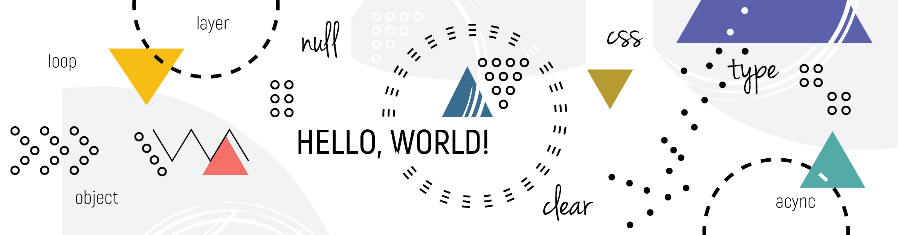

 

  
 

      <h3  font-size="24px" color="black">ABOUT ME</h3>
       
IT-сфера привлекает меня разнообразием задач и разнообразием путей их решения.

Мне нравится работать над frontend-частью проектов, отвечать за разработку логики интерфейсов.

В свободное время стараюсь детально изучить алгоритмы и структуры данных. Поддерживаю уровень своего английского чтением технических статей и IT-форумов.

  

                

  

   <h3  style="font-size:24px; color:#000;">LEARNING</h3>
         <ul > 
            <li>Effective TypeScript </li>
            <li>Algorithms and data structures</li>
        </ul>

        <h3  style="font-size:24px; color:#000;">STATISTICS</h3>
        

          
          
          
        

 

