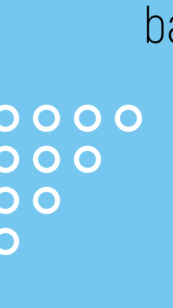

 

  
 

 

     <h3  style="font-size:24px; color:#000;">ОБО МНЕ</h3>
       
Я увлечена веб-разработкой, ценю элегантный дизайн и хорошо структурированный код.

          <ul > 
            <li>хорошие знания HTML5, CSS3</li>
            <li>хорошие знания Grid и Flexbox верстки</li>
            <li>хорошие знания JavaScript и DOM</li>
            <li>понимание методологии BEM</li>
            <li>опыт работы с макетами Figma</li>
            <li>кроссбраузерная, адаптивная, семантическая верстка</li>
            <li>базовые знания React (JSX, функциональные компоненты и хуки)</li>
             <li>базовые знания Node.js, Express.js, mongoDB</li>
              </ul>
              
--------------------------------------------------------------------------

        

           
            
             
             
          
          
            
          
                      
          
             
        

  

   <h4  style="font-size:24px; color:#000;">СЕЙЧАС ИЗУЧАЮ 📚</h4>
         <ul > 
            <li>Эффективный TypeScript</li>
            <li>Алгоритмы и структуры данных</li>
    </ul>

        <h3  style="font-size:24px; color:#000;">СТАТИСТИКА</h3>
        

          
          
          
          
        

 

  
  
