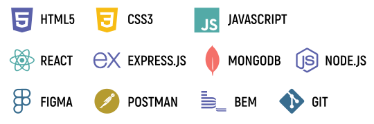

 

  
 

      <h3  font-size="24px" color="black">ABOUT ME</h3>
       
IT-сфера привлекает меня разнообразием задач и разнообразием путей их решения, возможностью постоянно развиваться. 

Мне нравится работать над frontend-частью проектов, отвечать за разработку логики и верстки интерфейсов, создавать элегантные и удобные веб-приложения.

В свободное время я стараюсь детально изучить алгоритмы и структуры данных. 

Люблю походы в лес и длинные прогулки на лыжах эимой.

          <ul > 
            <li>хорошие знания HTML5, CSS3</li>
            <li>хорошие знания Grid и Flexbox верстки</li>
            <li>хорошие знания JavaScript и DOM</li>
            <li>понимание методологии BEM</li>
            <li>опыт работы с макетами Figma</li>
            <li>кроссбраузерная, адаптивная, семантическая верстка</li>
            <li>базовые знания React (JSX, функциональные компоненты и хуки)</li>
             <li>базовые знания Node.js, Express.js, mongoDB</li>
              </ul>
              
-------------------------------------------------------------------------

        

            
        

  

   <h3  style="font-size:24px; color:#000;">LEARNING</h3>
         <ul > 
            <li>Effective TypeScript </li>
            <li>Algorithms and data structures</li>
        </ul>

        <h3  style="font-size:24px; color:#000;">STATISTICS</h3>
        

          
          
          
          
        

 

  
  
